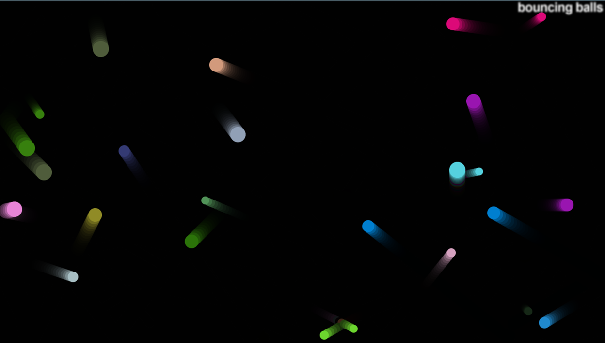

# **Bouncing Balls Project**

[MDN Web Doc Tutorial](https://developer.mozilla.org/en-US/docs/Learn/JavaScript/Objects/Object_building_practice#lets_bounce_some_balls)

 

#### The purpose of the project is to gain experience building and understanding JavaScript objects, and if time allows expand into Object Oriented Programming.

 

[Check out my project...](https://chad-powellv1.github.io/bouncing-balls/)

 

.
